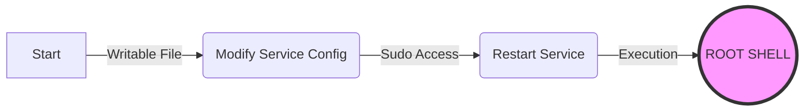

<div align="center">

# Nullpeas (v2.0)
### Local Privilege Escalation Logic Engine


**Stop enumerating. Start chaining.** Nullpeas is not a scanner that dumps thousands of lines of text.  
It is an **Adversarial Reasoning Engine** that builds attack graphs and generates instant exploits.

[Key Features](#-key-features) •
[Installation](#-installation) •
[Usage](#-usage) •
[Architecture](#-architecture) •
[Disclaimer](#-disclaimer)

</div>

---

## ⚡ What makes v2.0 different?

Traditional tools follow a **Find → Print** model. They find a misconfiguration and print it, leaving the operator to connect the dots.

**Nullpeas v2.0** follows a **Probe → Reason → Chain → Act** model.
It understands relationships between findings. It knows that a writable config file is useless unless a service executes it. It validates exploitability before reporting it.

> **Nullpeas doesn't just tell you what is wrong. It gives you the exact command to become root.**

---

## 🔥 Key Features

### ⚔️ The Action Engine
Knowing a vulnerability exists is half the battle. Executing it is the rest.
Nullpeas features a template-driven **Exploit Generator**.
* **Instant Gratification:** High-confidence exploits are printed directly to `STDOUT` for immediate copy-pasting.
* **Context Aware:** Generates commands specific to the target (e.g., `sudo vim -c ...` vs `echo "..." >> /etc/cron.d/target`).
* **Payloads:** Includes templates for GTFOBins, Docker Breakouts, Cron Injections, SUID abuse, and PATH hijacking.

### 🗺️ Visual Attack Maps
Text walls are hard to parse under pressure. Nullpeas generates a **Mermaid.js** flowchart in the final report, visualizing the exact path from "Start" to "Root".


---

### 🧠 Smart Chaining Logic

The engine utilizes a graph-based reasoning system to link primitives:

- Persistence Chains: Links Arbitrary File Write → Service Misconfiguration → Root.
- Trap Chains: Links Writable PATH → Common Root Commands → Interception.
- Timed Chains: Links Writable Cron File → Scheduled Execution.

---

### 🛡️ Stealth & Stability

- Anti-Forensics: Does not execute exploits during scanning. Only validates feasibility using safe calls (e.g., os.access).
- Reverse Shell Ready: Automatically detects non-interactive shells (no TTY) and skips the interactive menu to prevent hanging.
- Locale Safe: Enforces LC_ALL=C to ensure consistent parsing regardless of the target's language settings.

---

### 🚀 Installation

## Option 1 git clone ( Recommended )
```text
git clone [https://github.com/Null0x-sh/Nullpeas.git](https://github.com/Null0x-sh/Nullpeas.git)
cd Nullpeas
chmod +x nullpeas.py
./nullpeas.py
```

### Option 2: Compiled Binary (Stealth/Portable)
- If you cannot install dependencies on the target, compile Nullpeas into a standalone binary using Nuitka or PyInstaller on your local machine.

```text
# On your attack box
pip install nuitka
python3 -m nuitka --onefile --follow-imports nullpeas.py

# Transfer the resulting binary to target
scp nullpeas.bin user@target:/tmp/
```

---

### 💻 Usage

## Interactive Mode
- Run in a standard terminal. Nullpeas will present a menu allowing you to select specific modules or run a full scan.
```text
./nullpeas.py
```

## Auto-Run Mode (Reverse Shells)
- If you are catching a shell with nc or socat and do not have a full TTY, Nullpeas detects this automatically. It will bypass the menu and immediately run all safe probes to ensure the tool does not hang waiting for input.

---

### 🏗️ Architecture

The v2.0 Brain operates in four distinct phases:

- Probes (The Eyes):
     - Fast, threaded collectors (Sudo, Env, Filesystem, Process, SUID).
       Gathers raw data without judgment.
- Modules (The Cortex):
     - Analyzes raw data to find Primitives.
       Example: "I found /usr/bin/vim is SUID root."
- Chaining Engine (The Logic):
     - Connects Primitives into Attack Chains.
       Reasoning: "SUID Vim" + "Known GTFOBin" = "Direct Root Escalation".
- Action Engine (The Hands):
     - Looks up the exploit template.
Generates: ./vim -c ':!/bin/sh'.

---

### ⚠️ Disclaimer

Nullpeas is for authorized security testing and educational purposes only.
This tool is designed to assist security professionals and students in understanding privilege escalation vectors. The authors take no responsibility for the misuse of this tool. Do not run this on systems you do not own or do not have explicit permission to test.
<div align="center">
<b>Happy Hacking. 🥜</b>
</div>